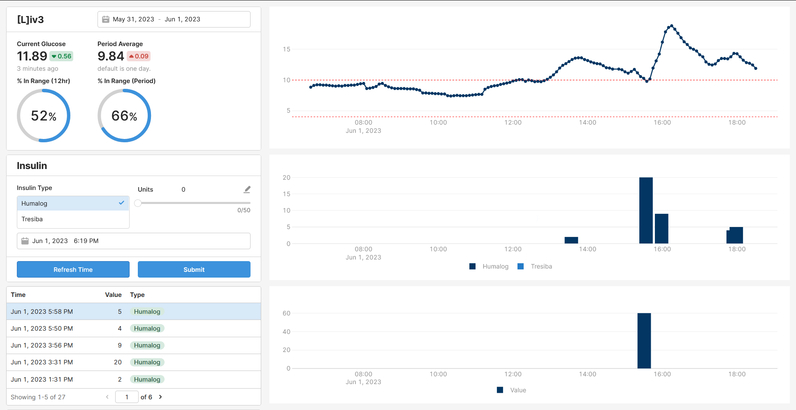
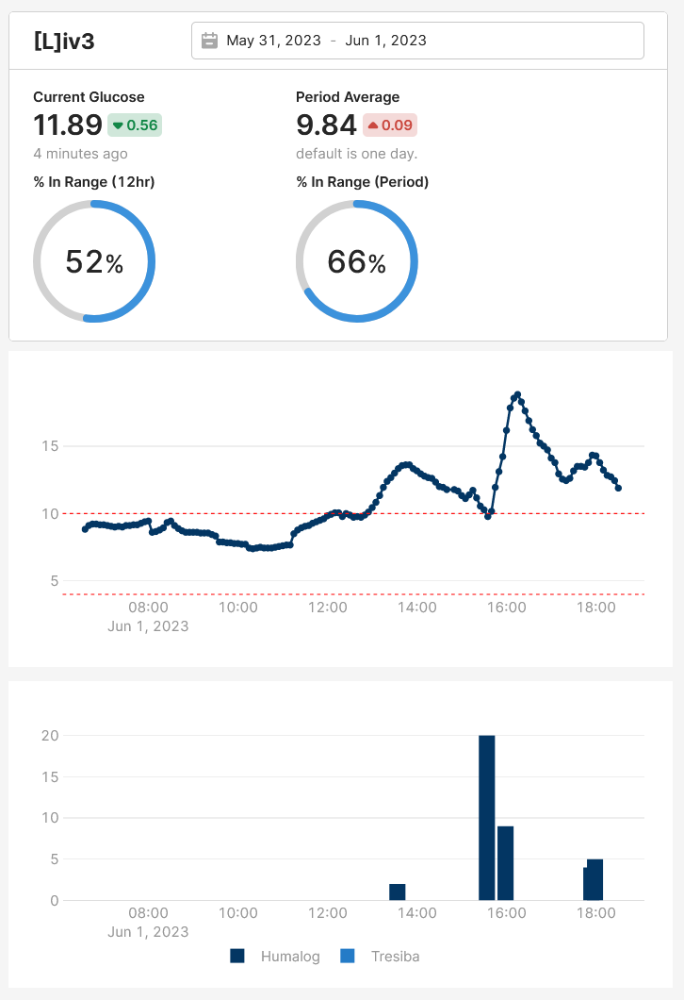

<div align="center">

# iv3

Yet another type 1 diabetes management solution.

**Third time's the charm. Right?**


_This image was generated using Midjourney._

</div>

## ToC

-   [Overview](#overview)
-   [Quickstart](#quickstart)
-   [Development and Deployment](#development-and-deployment)
-   [Configuration](#configuration)
-   [Roadmap](#roadmap)

## Overview

iv3 is a type 1 diabetes management solution, designed to make managing T1D easier.

Note, this project is **very experimental** and mostly meant for personal use. It is designed to be used in conjunction with tools like [Retool](https://retool.com/) and [ntfy](https://ntfy.sh/) for setting up cross-platform dashboards and alerts. Currently, only the backend service is provided, but you can use the endpoints to make your own dashboards.

<div align="center">
	<a href=".media/iv3_desktop_retool.png"></a>
	<a href=".media/iv3_mobile_retool.png"></a>
</div>

### Motivation

The reason for this project was because I needed a solution that could:

-   Easily collect, export, and experiment with continuous glucose monitoring (CGM) data
-   Better alerts for things like missed insulin and forecasting (Dexcom would frequently not send me notifications for high glucose)
-   An alternative to closed-loop monitoring solutions (like [Nightscout](https://nightscout.github.io/)) since I personally still use pens
-   And most importantly, for fun!

## Quickstart

To get started, configure `.env` and `config.yaml` under [Development and Deployment](#development-and-deployment) and [Configuration](#configuration), respectively.

If you have [Task](https://taskfile.dev/) installed, run:

```
task build
task all
```

If you prefer to use docker compose only, run:

```
docker compose --env-file .env up -d
```

Or, if you want to develop locally, run:

```
go run *.go -influxdbToken $INFLUXDB_TOKEN
```

## Development and Deployment

This project is **primarily** meant for personal use, so the steps outlined here are left mostly as a note for myself. The configuration here is tailored for my specific usecases, but feel free to adapt them for your usecases.

See [`example-config.yaml`](example-config.yaml) for some example configurations and additional details. Setup will also require a few other things:

-   A `.env` file for things that are used by Task and docker compose
    -   `INFLUXDB_TOKEN=...` to access InfluxDB
    -   `IV3_ENV=...` to specify the dev environment
-   A `config.yaml` file for application-level settings
    -   Dexcom, DigitalOcean Spaces keys and secrets
    -   Insulin and alerting configs
-   A domain name, and SSL certificate for HTTPS (needed for Retool)
    -   This will be needed for authentication, and for Retool API integrations
    -   `certfile.crt`, `keyfile.key`
    -   **Note:** At this moment, these files need to be located inside `_iv3_ssl` since it is mounted onto iv3, and will not work otherwise

### InfluxDB

The configuration and data for InfluxDB are mounted on `_iv3_config` and `_iv3_data` respectively, so remember to create these! Additionally, when starting the InfluxDB instance for the first time, we need to register and create an API token, see [here](https://hub.docker.com/_/influxdb) for details.

Once that is done, remember to also add it to the `config.yaml` file.

### Retool

WIP.

### ntfy

WIP.

### Deploy

To easily move images between servers, save the images as a tarball, and load it.

```
<!-- Save the images as a tarball. -->
task build
docker save -o iv3.tar iv3-iv3:latest

<!-- Copy and load. -->
scp iv3.tar addr:path
docker load -i iv3.tar
```

### Operations

To perform a backup or restore, run:

```
task idb-backup
task idb-restore
```

See `Taskfile.yaml` for more commands.

## Configuration

WIP.

## Roadmap:

My TODO list in no particular order:

-   Update Retool graphs and dashboard (mobile support)
-   Have target glucose for different times of the day
-   More configurable defaults and options
-   Factor in insulin to carbs ratio, and have a way to calculate it
-   ChatGPT integration
-   Different predictors for low glucose
-   Add check before persisting DB to S3
-   Automatic S3 bucket cleanup (retention policy)
-   Dexcom G7 support

For my previous attempts on software for managing T1D, see [ichor](https://github.com/algao1/ichor) and [iv2](https://github.com/algao1/iv2).

## Dependencies

-   [Task](https://taskfile.dev/)
-   [InfluxDB](https://www.influxdata.com/)
-   [Retool](https://retool.com/)
-   [ntfy](https://ntfy.sh/)
